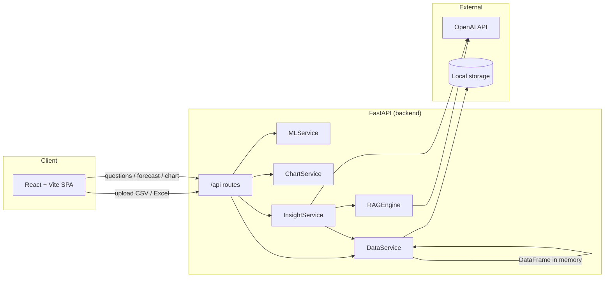
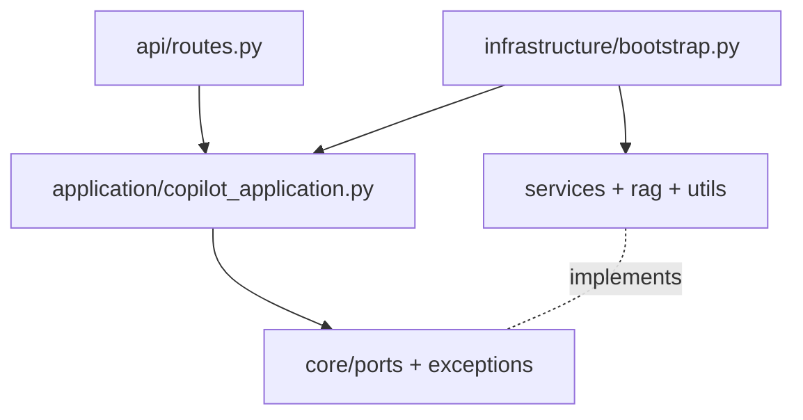

# System architecture

## Goals

- **Structured truth:** Numeric summaries and aggregations come from **Pandas** on the uploaded dataset.
- **Semantic retrieval:** Relevant rows are surfaced with **embeddings + FAISS** (RAG over tabular rows as text).
- **Narrative and reasoning:** **OpenAI** turns statistics + retrieved rows into CFO-style explanations.
- **Visualization contract:** The backend returns **JSON chart specs** shaped for Chart.js (or similar) on the frontend.

## High-level diagram

## Module map (backend)

| Path | Responsibility |
|------|----------------|
| `backend/main.py` | App factory, CORS, router mount, `/health` |
| `backend/api/routes.py` | HTTP layer: validation, status codes, delegates to services |
| `backend/models/schemas.py` | Pydantic models for requests/responses |
| `backend/utils/config.py` | Environment-backed settings (`OPENAI_*`, storage path) |
| `backend/services/data_service.py` | Save upload, load DataFrame, metadata, `describe()` summary |
| `backend/services/ml_service.py` | `LinearRegression` forecast on time or row index |
| `backend/services/chart_service.py` | Build Chart.js-style `labels` + `datasets` |
| `backend/services/insight_service.py` | Orchestrates stats + RAG + LLM prompt |
| `backend/rag/rag_engine.py` | Row textification, embeddings, FAISS `IndexFlatL2`, similarity search |

## Technology choices

| Layer | Technology | Role |
|-------|------------|------|
| HTTP | FastAPI | Async-capable API, OpenAPI/Swagger |
| Data | Pandas | Loading CSV/Excel, summaries |
| ML | scikit-learn | Baseline regression for forecasts |
| Vector search | faiss-cpu | In-process ANN index per dataset |
| LLM | OpenAI Python SDK | Embeddings + responses for insights |

## Security notes (production hardening)

- Restrict **CORS** origins to your frontend URL.
- Run behind **HTTPS**; never log raw API keys or full row payloads at info level.
- Validate **file size** and scan uploads; consider antivirus and private bucket storage.
- **Secrets:** inject `OPENAI_API_KEY` via your orchestrator (Kubernetes secrets, AWS SSM, etc.), not committed `.env`.

## Deployment (Docker)

- **api:** `docker/Dockerfile.backend` — Python 3.12, FastAPI, persisted uploads via `STORAGE_DIR` volume.
- **web:** `docker/Dockerfile.frontend` — builds the Vite app, serves with **nginx**; `docker/nginx.conf` proxies `/api/` to the API service.

`docker-compose.yml` runs both; the browser uses **relative** `/api` URLs so nginx can proxy without CORS friction.

## Code layering (clean / hexagonal)

The Python backend separates **presentation** (`api/`), **application use cases** (`application/`), **ports & domain errors** (`core/`), and **adapters** (`services/`, `rag/`, `utils/`). The **composition root** is `infrastructure/bootstrap.py`. Full rules and file map: **[ARCHITECTURE_CODE.md](ARCHITECTURE_CODE.md)**.

## Related documents

- [ARCHITECTURE_CODE.md](ARCHITECTURE_CODE.md) — layers, dependency rules, composition root  
- [DATA_FLOW.md](DATA_FLOW.md) — request lifecycle  
- [API.md](API.md) — REST contract  
- [SCALING.md](SCALING.md) — growth path  
