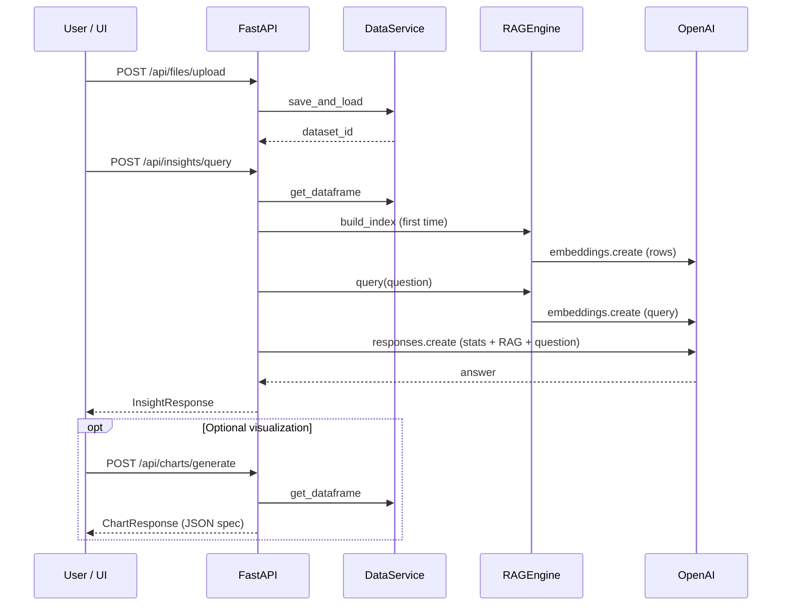

# Data flow

This document describes how data moves through the system for the main user journeys implemented in the current backend.

## 1. Upload dataset

1. Client sends `POST /api/files/upload` with `multipart/form-data` and a file.
2. `routes.upload_file` checks `content_type` for CSV or Excel.
3. `DataService.save_and_load`:
   - Ensures `storage_dir` exists (`utils.config.ensure_storage_dir`).
   - Writes the file as `{uuid}{extension}` under that directory.
   - Reads into a **Pandas DataFrame** (`read_csv` or `read_excel`).
   - Stores the DataFrame and `DatasetMetadata` in **process memory** keyed by `dataset_id`.
4. Response returns `dataset_id` and metadata (columns, row count).

**Important:** DataFrames live in memory only. A server restart drops them unless you add persistence or reload logic.

## 2. Summary statistics

1. Client calls `GET /api/datasets/{dataset_id}/summary`.
2. `DataService.get_summary` loads the DataFrame, runs `describe(include="all")`, and sets `time_grain` to `"auto"` if any `datetime64[ns]` columns exist.

Use this endpoint to power a dashboard “overview” card or to preview distributions before asking the LLM.

## 3. Hybrid AI insight (analysis + explanation)

1. Client calls `POST /api/insights/query` with `dataset_id`, `question`, optional `business_context`.
2. `InsightService.generate_insight`:
   - Loads the DataFrame from `DataService`.
   - **RAG index:** If no FAISS index exists for this `dataset_id`, `RAGEngine.build_index`:
     - Converts each row to a comma-separated `col=value` string.
     - Embeds all row strings via OpenAI embeddings API.
     - Builds `faiss.IndexFlatL2` and stores vectors + row texts in memory.
   - Computes **Pandas** `describe()` and the first five rows as sample records.
   - Runs **RAG query:** embeds the user question, searches top-`k` similar rows (default `k=8` in code).
   - Builds a **structured prompt**: system role (CFO analyst) + user content with stats, samples, and RAG hits.
   - Calls OpenAI **`responses.create`** with the configured chat model; returns `output_text` as the answer.
3. Response includes `answer` and `supporting_facts` (summary stats + sample records). RAG snippets are inside the model context but not duplicated in `supporting_facts` today.

This path combines **exact aggregates** (from `describe`) with **row-level retrieval** (FAISS) and **language reasoning** (LLM).

## 4. Forecast (ML)

1. Client calls `POST /api/predictions/forecast` with `dataset_id`, `target_column`, optional `date_column`, `horizon`.
2. `MLService.forecast`:
   - If `date_column` is provided and exists: sorts by date, uses a monotonic **`time_index`** (0..n-1) as `X`.
   - Else: uses **`row_index`** as `X`.
   - Fits `LinearRegression` on a time-ordered train split (`train_test_split(..., shuffle=False)`).
   - Predicts `horizon` future steps from the last index.
   - Timestamps in the response: if date mode, last date + monthly `PeriodIndex` heuristic; else integer offsets past the last row.

Use this as a **baseline**; production systems often swap in Prophet, ARIMA, or gradient boosting with proper backtesting.

## 5. Chart generation

1. Client calls `POST /api/charts/generate` with `dataset_id`, `x_column`, `y_column`, `chart_type` (`line` or `bar`).
2. `ChartService.generate_chart`:
   - Validates columns exist.
   - Emits labels (x as string) and y as float series.
   - Wraps in a **Chart.js-oriented** structure: `spec.data.labels`, `spec.data.datasets[]`, `spec.options`.

The frontend renders with Chart.js (or maps fields to another library).

## Sequence: “Why did revenue drop last month?”

